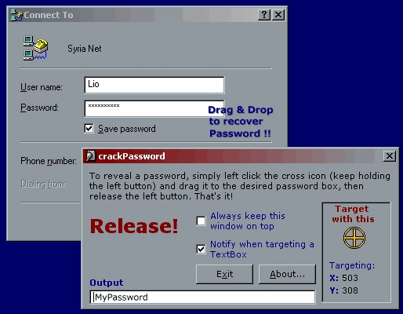



## crackPassword

### Description

Have you ever forgotten your saved Dial-up Networking password? Don't worry. crackPassword is a complete application that lets you recover any text hiden behind those charming asterisks from almost any PasswordField!! It's very simple. No additional ActiveX controls needed, just a few API calls. And that's not all, it can recover Captions from Dialogs, Forms, CommandButtons, CheckBoxes, ... Check it out now!! ** Does NOT work on Win 2000/XP! **
 
### More Info
 

             |
---                |---
**Submitted On**   |2000-12-29 16:01:04
**By**             |[Lio\_889](https://github.com/Planet-Source-Code/PSCIndex/blob/master/ByAuthor/lio-889.md)
**Level**          |Intermediate
**User Rating**    |4.6 (91 globes from 20 users)
**Compatibility**  |VB 5\.0, VB 6\.0
**Category**       |[Windows API Call/ Explanation](https://github.com/Planet-Source-Code/PSCIndex/blob/master/ByCategory/windows-api-call-explanation__1-39.md)
**World**          |[Visual Basic](https://github.com/Planet-Source-Code/PSCIndex/blob/master/ByWorld/visual-basic.md)
**Archive File**   |[CODE\_UPLOAD1313912292000\.zip](https://github.com/Planet-Source-Code/lio-889-crackpassword__1-13931/archive/master.zip)

